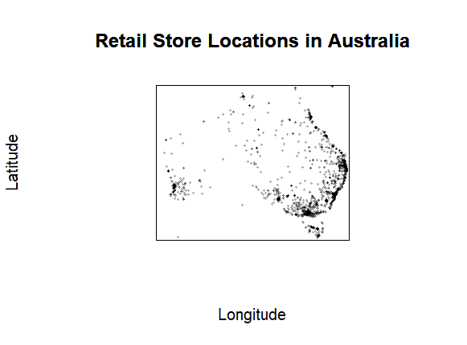
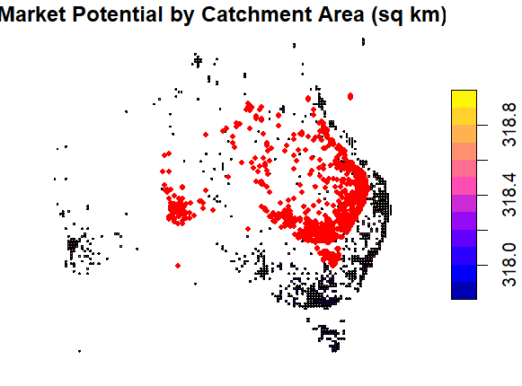
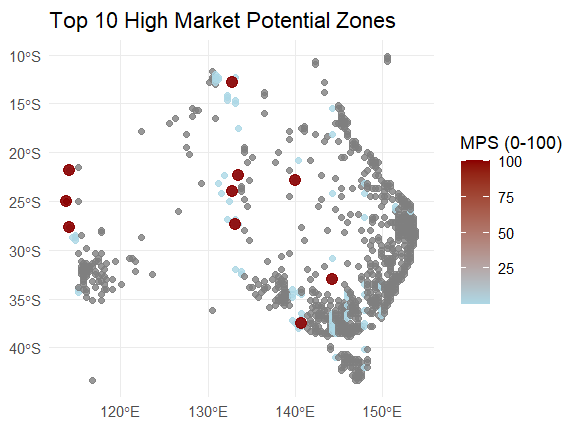
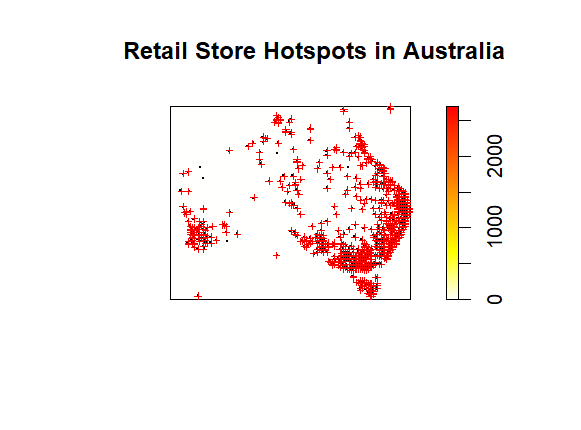
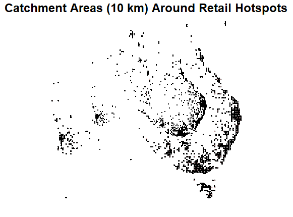
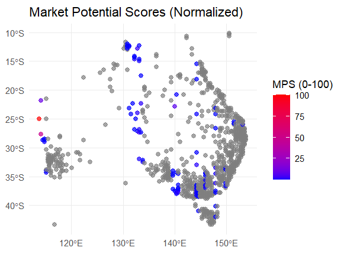

# Retail Store Market Expansion (Australia) 🗺️📍  
**Spatial analytics + market potential scoring to identify the best zones for retail expansion across Australia.**

> This repository demonstrates an end-to-end **geospatial analytics workflow** in **R**: cleaning location data, detecting retail hotspots, building catchment areas, engineering demographic/economic features from ABS, and producing a **Market Potential Score (MPS)** to prioritize expansion locations.

---

## Table of Contents
- [Project Summary](#project-summary)
- [Business Problem](#business-problem)
- [Objectives](#objectives)
- [Approach Overview](#approach-overview)
- [Data Sources](#data-sources)
- [Methods](#methods)
  - [1) Data Cleaning & Validation](#1-data-cleaning--validation)
  - [2) Hotspot Detection (Spatial Density)](#2-hotspot-detection-spatial-density)
  - [3) Catchment Analysis (10 km Buffers)](#3-catchment-analysis-10-km-buffers)
  - [4) Market Potential Score (MPS)](#4-market-potential-score-mps)
  - [5) Opportunity Mapping (High MPS, Low Density)](#5-opportunity-mapping-high-mps-low-density)
- [Key Visual Outputs](#key-visual-outputs)
- [Insights & How to Read the Maps](#insights--how-to-read-the-maps)
- [Recommended Business Actions](#recommended-business-actions)
- [Limitations & Assumptions](#limitations--assumptions)
- [How to Run Locally](#how-to-run-locally)
- [Project Structure](#project-structure)
- [Reproducibility Notes](#reproducibility-notes)
- [License](#license)
- [Contact](#contact)

---

## Project Summary
Retail expansion decisions are often expensive and difficult to reverse. This project provides a data-driven method to answer:

**“Where should a retailer expand next in Australia, and why?”**

It combines:
- **Observed retail presence** (store points)
- **Spatial clustering** (hotspots)
- **Catchment coverage** (buffer zones)
- **Demographic & economic demand indicators** (ABS)
- A single prioritization metric: **Market Potential Score (MPS)**

The output is a set of **ranked, mapped zones** that highlight:
- where retail is already concentrated,
- where demand signals are strong,
- and where expansion may be attractive due to **high potential but lower existing retail density**.

---

## Business Problem
Retail networks typically grow via a mix of:
- intuition (“we should open near X”),
- competitor presence,
- demographic growth corridors,
- and operational constraints (distribution routes, leases, labour).

But intuition alone can miss emerging demand pockets and lead to:
- cannibalisation (opening too close to existing stores),
- oversaturated markets,
- or ignoring fast-growing corridors where demand is increasing.

This project introduces a repeatable spatial analytics framework to:
- quantify demand signals,
- reduce overlap,
- and make the expansion logic transparent and explainable.

---

## Objectives
1. **Map existing retail locations** and verify geographic validity for Australia.  
2. Detect **hotspots** (high-density retail clusters) to understand where retail is concentrated today.  
3. Build **catchment areas** (10 km buffers) around hotspots to approximate store reach and identify overlap.  
4. Engineer a **Market Potential Score (MPS)** using ABS demographic & economic indicators to represent demand strength.  
5. Produce **opportunity maps** to highlight zones that are:
   - **high MPS (strong demand)** and
   - **low retail density (less saturation)**

---

## Approach Overview
At a high level:

1) **Prepare retail store point data**  
2) **Detect hotspots via spatial density**  
3) **Create 10 km catchment buffers**  
4) **Join ABS indicators into spatial zones**  
5) **Compute and normalize MPS**  
6) **Visualize expansion opportunities**  

This gives a coherent story: *where stores are → where stores cluster → how far they reach → where demand is high → where demand is under-served.*

---

## Data Sources
- **Retail Shop Locations:** OpenStreetMap “Shops” dataset for Australia/Oceania via ArcGIS Hub  
  - Link: https://onemap-esri.hub.arcgis.com/datasets/988071da24954be5b250a5d2a6bc6cab_0/about  
- **Demographic / Socio-economic Indicators:** Australian Bureau of Statistics (ABS) — Data by Region methodology / downloads  
  - Link: https://www.abs.gov.au/methodologies/data-region-methodology/2011-24#data-downloads  

> Note: OSM coverage varies across regions and store categories. ABS indicators are authoritative but may require alignment to the appropriate geographic boundary (e.g., SA2/SA3/LGA).

---

## Methods

### 1) Data Cleaning & Validation
Retail point datasets often include:
- duplicate records,
- invalid coordinates (0,0 or swapped lat/long),
- non-Australian points (data extraction spillover),
- missing values or malformed geometry.

Cleaning steps typically include:
- removing duplicates,
- filtering coordinates to Australian bounds,
- validating coordinate ranges and dropping outliers,
- converting to `sf` geometry,
- ensuring a consistent CRS (coordinate reference system).

**Outcome:** a reliable point layer representing retail locations in Australia.

---

### 2) Hotspot Detection (Spatial Density)
To understand where retail is concentrated, the project applies spatial density analysis to identify clusters.

Common ways to do this in R include:
- **Kernel Density Estimation (KDE)** using `spatstat`  
- grid-based intensity surfaces  
- or distance-based clustering approaches

The result is a “heat-style” surface highlighting where point density is highest — typically aligned with major metro areas and commercial corridors.

**Why it matters:** hotspots represent *current retail gravity*, helping you understand saturation and coverage.

---

### 3) Catchment Analysis (10 km Buffers)
Once hotspots are identified, the project creates **10 km buffer zones** around hotspot locations.

These buffers approximate:
- practical customer reach,
- store trade area overlap,
- and areas already well-covered by existing retail concentration.

**Why 10 km?**  
It’s a reasonable default for many retail categories in metro/suburban contexts.  
(For different categories, this should be tuned: e.g., 2–5 km for convenience retail, 20+ km for destination retail.)

---

### 4) Market Potential Score (MPS)
MPS is a composite score representing **demand strength** in a region using ABS indicators such as:
- population,
- working-age population,
- employment,
- spending power / income proxy (depending on available fields).

**Typical workflow:**
1. Select indicators (features) representing market demand.  
2. Transform and normalize them (e.g., z-score or min-max).  
3. Apply weights (equal or business-defined).  
4. Combine into a single score.  
5. Normalize to an interpretable scale (e.g., 0–100).

A general template (example only—adjust in code):
- `MPS_raw = w1 * Pop + w2 * WorkAge + w3 * Employment + w4 * Spending`
- `MPS = normalize(MPS_raw) → [0, 100]`

**Why it matters:** MPS converts multiple demand signals into a single ranked metric for prioritization.

---

### 5) Opportunity Mapping (High MPS, Low Density)
The key expansion signal is not just “high demand”, but **high demand where retail presence is not already dense**.

This project visualizes:
- **High-MPS zones** (demand)  
- alongside density/hotspots (supply saturation proxy)

This helps identify:
- growth corridors outside CBD cores,
- outer suburban hubs,
- and selected regional centres with strong demand indicators.

---

## Key Visual Outputs

### Retail Store Locations in Australia  
Shows the raw distribution of retail points after cleaning.



---

### Market Potential by Catchment Area (sq km)  
Highlights catchment-scale market potential. This is useful to see how demand varies by region size/coverage.



---

### Top 10 High Market Potential Zones  
A ranked view of the strongest demand zones based on MPS (0–100). These are your “shortlist candidates”.



---

### Retail Store Hotspots in Australia  
A density surface indicating where retail is concentrated (existing supply / saturation proxy).



---

### Catchment Areas (10 km) Around Retail Hotspots  
Visualises the reach and overlap of hotspot trade areas, useful for coverage planning.



---

### Market Potential Scores (Normalized)  
Displays MPS across Australia on a consistent 0–100 scale (easy to compare).



---

## Insights & How to Read the Maps
Below are practical interpretation notes (what you would say in a report / stakeholder deck).

### 1) Store Locations Map
- Dense point concentrations typically align with population centres and commercial corridors.
- Sparse regions may reflect:
  - lower population density, **or**
  - data coverage differences (OSM completeness varies), **or**
  - fewer retail categories captured.

**Use it for:** verifying data realism and understanding baseline coverage.

### 2) Hotspot Map (Density Surface)
- “Hot” areas reflect high existing retail presence, which can mean:
  - strong demand (good), but also
  - high competition / saturation (risk).
- Hotspots are expected in metro areas, but *how quickly density falls off* can reveal:
  - suburban dispersion patterns,
  - and potentially under-served fringes.

**Use it for:** identifying saturation and existing “retail gravity”.

### 3) 10 km Catchment Buffers
- Buffers help visualize overlap—too much overlap suggests:
  - potential cannibalisation risk,
  - or limited incremental coverage from a new store.
- Gaps between buffers can indicate:
  - under-covered corridors,
  - or areas where a new store might improve network reach.

**Use it for:** store network planning and spacing strategy.

### 4) MPS Map (0–100)
- High MPS zones indicate stronger demand signals (as defined by selected ABS features).
- The best expansion candidates are often:
  - **high MPS** but **not inside the hottest retail clusters**.

**Use it for:** prioritizing demand-first decision making.

### 5) Top-10 Zones
- This is your shortlist for deeper feasibility work:
  - lease availability,
  - competitor analysis,
  - logistics and staffing,
  - and local compliance considerations.

**Use it for:** turning analytics into an action pipeline.

---

## Recommended Business Actions
This analysis supports a practical expansion workflow:

1) **Shortlist** high-MPS zones (e.g., top decile or top 10)  
2) **Screen out** zones that are heavily covered by existing hotspot catchments (overlap risk)  
3) For remaining candidates, run a deeper feasibility assessment:
   - competitor presence and category fit,
   - foot traffic proxies (if available),
   - local growth rates (ABS time-series),
   - operational constraints (warehouse routes, staffing availability).

**A strong expansion thesis typically looks like:**  
✅ High MPS (demand) + ✅ low/moderate density (less saturation) + ✅ network coverage gap + ✅ operational feasibility.

---

## Limitations & Assumptions
- **OSM data coverage bias:** some regions/categories may be underrepresented.  
- **MPS is only as good as the features chosen:** indicator selection and weighting matter.  
- **Catchment radius is a simplification:** real trade areas depend on roads, transport, barriers, and customer behaviour.  
- **No competitor separation (unless included in OSM categories):** “retail stores” can mix many store types.  
- **Spatial resolution:** results depend on the geographic boundary used (SA2/SA3/LGA) and how joins are performed.

> Recommendation: treat this as a decision-support tool, then validate finalists with local context and additional datasets.

---

## How to Run Locally

### 1) Clone the repository
```bash
git clone https://github.com/IshanKhanijo/Retail-Store-Expansion.git
cd Retail-Store-Expansion
```

### 2) Open the script
Open `Retail_Store_Project.R` in **RStudio**.

### 3) Install required packages
In R:
```r
install.packages(c("sp", "sf", "spatstat", "gstat", "geoR", "dplyr", "ggplot2"))
```

### 4) Run the workflow
Run the script top-to-bottom. It will:
- clean and prepare point data,
- detect hotspots,
- generate buffers,
- compute and normalize MPS,
- and export/plot visuals.

---

## Project Structure
Typical structure (update to match your repo files):
- `Retail_Store_Project.R` — main analysis script  
- `data/` — raw and cleaned datasets (if included / or user-provided)  
- `outputs/` — generated figures, maps, intermediate layers  
- `*.png` — key visual outputs used in the README  
- `README.md` — project documentation  
- `LICENSE` — MIT License  

---

## Reproducibility Notes
- Ensure all datasets are available locally and paths in the script match your machine.  
- Use a consistent CRS for distance-based operations (buffers) — ideally a projected CRS suitable for Australia for accurate km distances.  
- If you update the buffer radius, KDE bandwidth, or MPS weights, note it in the README for transparency.

---

## License
This project is licensed under the MIT License — see the **LICENSE** file for details.

---

## Contact
If you want to collaborate or discuss improvements:

- **LinkedIn:** www.linkedin.com/in/ishankhanijo  
- **GitHub:** https://github.com/IshanKhanijo  
---
